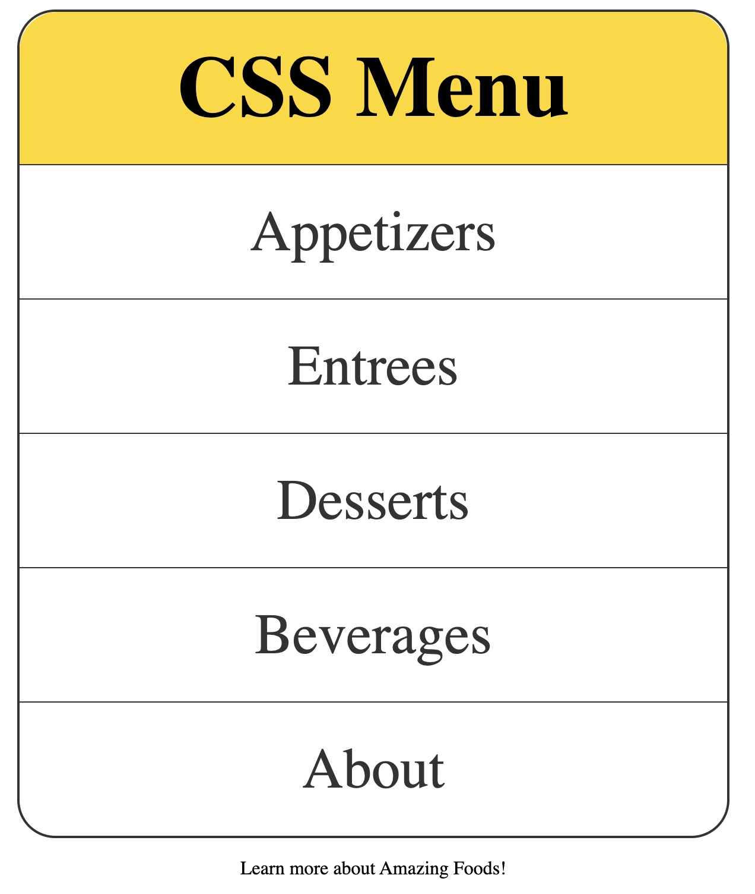

# **CSS Menu**

**Description:** This Mini Project creates a CSS Menu

## **Prerequisites**

To accomplish this project you should have **CSS** knowledge of
- Selectors
- Colors
- Units and Sizes
- The Box Model
- Typography
- Styling Links
- List Styles

You must also have basic knowledge of **HTML**

## **Output**

<picture>
  
</picture>