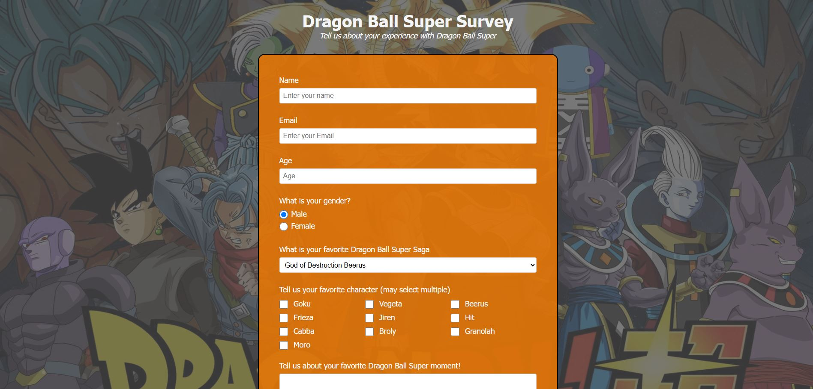

# **Survey Form**

**Description:** This is a simple survey form for Dragon Ball Super.

This project uses 
- Form
- Fieldsets/Legends
- Selects
- Button
- Labels/Inputs
- CSS classes
- radial-gradient
- grid
- border-box
- some understanding of block formatting context
- and a tad of javascript

## **Output**

<picture>
  
</picture>